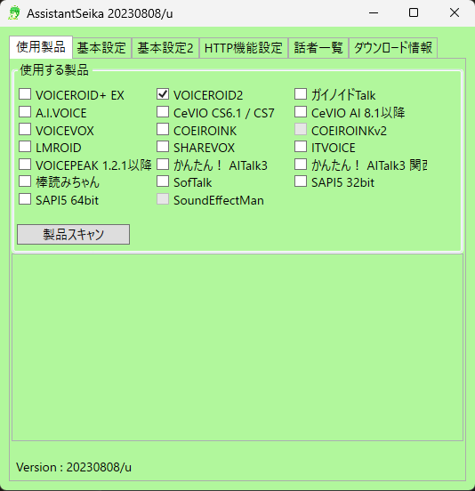
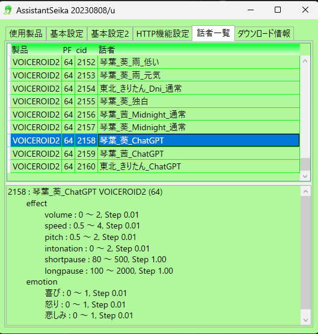

# ChatGPTandVOICEROID
ChatGPT(API)との会話をマイクで行いVOICEROIDやVOICEVOXで読み上げさせるだけのスクリプト  
run.batを起動した後、キャラクター名を呼びかけることで対象キャラのプロンプトを使いチャットを開始する  
  
※初期設定ではマイク入力、音声読み上げで会話するようになっている為、テキストのみで使う場合は`config.yaml`の`Text_Only: False`をTrueに変更する  

## Install
1. `.env`ファイルにOpenAIのAPI Keyを入力する
2. `setup.bat`を実行
3. [VOICEVOX](https://voicevox.hiroshiba.jp/)をDL、インストールする(少なくともずんだもんで音声再生可能な環境にする)

## Usage
1. `run.bat`を実行
2. 「起動しました！」のメッセージが出た後にキャラクター名を入力(例：ずんだもん、葵、茜、きりたん、etc...)
3. 対象のキャラクターとのチャット会話が開始する
  
「前回の続き」と入力することで前回のsummary.txtを読み込む  
「検索して」を含む文章を入力することでGoogle検索結果を踏まえて回答する(要Option設定)  
「エンド」と入力することでキャラクターとの会話を終了する  
再度「エンド」と入力することでbatを終了する  
  
注意：「おやすみ」「PCをシャットダウン」と入力すると会話を要約してからshutdownコマンドを実行する為注意(完全一致でのみ実行)  

## Option
### VOICEROID Setup
Installの手順ではまだVOICEROIDの読み上げが実行できない  
1. [Assistant Seika](https://wiki.hgotoh.jp/documents/tools/assistantseika/assistantseika-001a)をDL、インストールする
2. `AssistantSeika.exe`と`VoiceroidEditor.exe`を起動する
3. VOICEROID2にチェックを入れる

4. 製品スキャンを実行
5. 話者一覧タブに移動し読み上げに使うボイスプリセットのcidを確認(画像は2158)

6. `./character/{キャラクター名}.yaml`の`voice_cid`を手順5で確認した値に変更する
7. `config.yaml`の`Assistant_Seika_flag`をTrueに変更する
  
CeVIOやCOEIROINK、ガイノイドTalk等AssistantSeikaが対応してるソフトであれば上記手順で設定可能  
その場合は`run.bat`でソフト自動起動までは行われないためあらかじめ立ち上げておく必要がある  

### GoogleSearch
会話中に「検索して」を含む文章を入れるとGoogle検索を利用して検索結果を踏まえた回答をする  
ただし事前にGoogle Cloud PlatformからCustom Search APIのAPI Keyを作成する必要がある  

1. Goole Custom Search APIのAPI Keyを作成する
[Custom Search APIを使ってGoogle検索結果を取得する - Qiita](https://qiita.com/zak_y/items/42ca0f1ea14f7046108c)
2. `.env`の`google_api_key`と`cx`を入力する
3. 自環境に合うJDKをインストール
[Java JDKのインストール方法（Windows &#038; Mac対応）｜Code for Fun](https://codeforfun.jp/how-to-install-java-jdk-on-windows-and-mac/)
4. `config.yaml`の`java_home`のパスをインストールしたJDKのバージョンに合わせ変更

### キャラクター追加
`./character/{キャラクター名}.yaml`を追加・修正することで可能
音声認識でキャラクター名が正常に認識されないことが多い場合は、よくご認識される文章を`ai_name`のリストに追記する  

### faster-whisper有効化
`config.yaml`の`record_model`をfaster-whisperに変更することで利用可能
聞き間違いが多くなる為非推奨  
※キャラクター名自体認識できなくなることを防ぐ為、`record_model`を変更しても起動直後の音声認識はwhisperのまま
